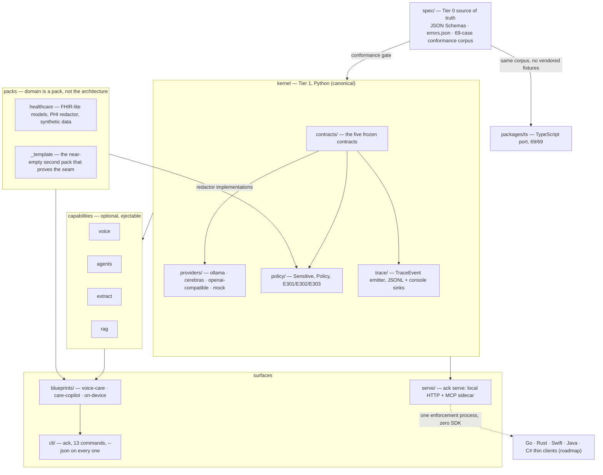
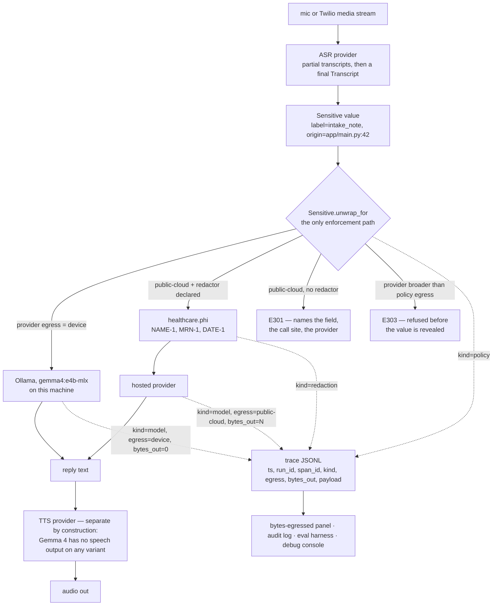

# agenticcarekit

> agenticcarekit — the open-model stack for health AI. Runs on your laptop. Ships with the privacy boundary built in.

**No telemetry, ever.** Apache-2.0. `ack` is the command, `agenticcarekit` is the package.

---

## What it is

Three things, and deliberately not a fourth:

- **A scaffolder.** `ack init` probes your machine concurrently, ranks open-weight
  models against the blueprint's actual requirements, prints the reason for every
  choice, and generates a repo you own outright.
- **A thin runtime.** Providers, the privacy boundary, trace, and four capabilities
  (voice, agents, extract, rag). Imported, never inverted.
- **A local sidecar.** `ack serve` puts the same kernel behind local HTTP (OpenAPI) and
  MCP, loopback-bound with a token file, so any language — or any agent — binds with
  zero SDK.

**What it is not: a framework.** Nothing inverts control. Nothing hides the
provider — every concrete provider exposes its raw client as `.client`. Every
abstraction is ejectable: drop the blueprint and keep the packs, drop the packs and
keep the capabilities, drop the capabilities and call the kernel directly.

The value is not the code. It is the encoded judgment: Gemma 4's behavioural quirks
applied in exactly one function, a privacy boundary that is a *type* rather than a code
comment, a mandatory mock on every tool so offline demos are real, and a 69-case
conformance corpus so the TypeScript port cannot drift.

---

## 60-second quickstart

Verified against this repo at `0.1.0`. No model download, no network, no accounts.

```bash
# 1 — scaffold a project you fully own
uvx --from git+https://github.com/roshaninfordham/agenticcarekit \
  ack init care --blueprint on-device --yes --offline

# 2 — run it with networking disabled: every tool falls back to its mock
cd care
uvx --from git+https://github.com/roshaninfordham/agenticcarekit ack demo --offline
```

The last line of the demo is the point of the whole project:

```
    ✓ 0 bytes egressed — all inference stayed on this device.
```

That number is not a slogan. It is `sum(e.bytes_out for e in run if e.egress != device)`
computed from the run's own trace.

To see what your machine can actually run, work from a checkout:

```bash
git clone https://github.com/roshaninfordham/agenticcarekit && cd agenticcarekit
uv sync
uv run ack doctor          # or --json, for agents
```

`ack doctor` and `ack explain` currently need a checkout — see
[Known issues](#known-issues-010).

---

## Architecture

One canonical implementation per tier, gated by a language-neutral spec.



The sidecar is the architectural move, not a convenience: the policy boundary,
redaction, and trace live in **one process**, so a thin Go client cannot bypass PHI
enforcement because it never touches the enforcement path. Ports become convenience,
not correctness surface. Detail: [docs/architecture.md](docs/architecture.md).

---

## Where the privacy boundary sits

A voice-care turn, and every place it emits into the trace:



Everything above the `unwrap_for` diamond is on-device by construction. Trace payloads
carry decisions and category names — never the value, never the removed spans.

---

## The plan screen

`ack init` prints its reasoning, then the non-interactive command that reproduces it
exactly. Real output from this repo, on an Apple M5:

```
  Plan
    blueprint     voice-care
    model         gemma4:e4b-mlx          ← -mlx build: native Apple Silicon
                                            acceleration on Apple M5
                                          ← e4b: native audio input, ~4.5B effective
                                            parameters
    providers     ollama                  ← local primary, no hosted fallback: egress
                                            stays on device and nothing leaves the
                                            machine (add one with --providers
                                            ollama,cerebras)
    pack          healthcare
    capabilities  voice, extract
    egress        device                  ← redactor healthcare.phi

  ↵ accept   e edit   ? why these

  Re-run this exactly:
    ack init --blueprint voice-care --model gemma4:e4b-mlx \
      --providers ollama --pack healthcare --yes
```

`ack init --why` prints the full ranked table, including every filter that eliminated a
candidate. The `←` annotations are asserted verbatim in the test corpus — a correct
recommendation with a wrong explanation is a failed test.

---

## Support matrix

Claiming broader support than has been tested is an explicit anti-goal. This table is
the contract.

| Path | Status | What that actually means |
|---|---|---|
| **Gemma 4 via Ollama** (`e2b`, `e4b`, `12b`, `26b`, `31b`, `-mlx`) | **Supported** | The message builder is conformance-verified: 20 `message-build` cases green on **both** Python and TypeScript. Transport is tested against recorded Ollama `/api/chat` request and response shapes through `httpx.MockTransport` and stubs. **No live-network CI** — nothing in this repo asserts a run against a live Ollama daemon. |
| **Cerebras** | **Declared, untested** | `CerebrasProvider` exists as a preset over the OpenAI-compatible transport, declares `public-cloud` egress, reads `CEREBRAS_API_KEY` at call time. No recorded transcript, no live call, no fixture. |
| **OpenAI-compatible endpoints** | **Declared, untested** | `OpenAICompatibleProvider` maps the same builder decisions onto `/chat/completions`. `top_k=64` cannot be expressed in that schema and is omitted rather than faked — documented in the code. |
| **Python** — kernel, capabilities, packs, CLI, sidecar, evals | **Canonical** | 69/69 conformance; full suite green apart from one known failing test. |
| **TypeScript** (`packages/ts`) | **Kernel conformance-verified** | 69/69 on the same shared corpus. `extract` and `agents` are ported but **unit-tested only**. `voice`, `rag`, and the provider HTTP clients are **not ported**. Details: [packages/ts/README.md](packages/ts/README.md). |
| **`ack serve` sidecar + MCP** | **Shipped** | Twelve HTTP routes under `/v1`, OpenAPI at `/openapi.json`, loopback-bound with a `0600` token file, plus seven MCP tools over stdio. Smoke-verified; treat it as new. |
| **Go / Rust / Swift / Java / C# thin clients** | **Roadmap** | The sidecar makes them possible; none are generated yet. |
| **Homebrew / Scoop / Docker / npx / Nix / GitHub Action** | **Roadmap** | Not implemented. `uvx` and `uv tool install` from git are the install paths that exist today. |

### Blueprint status

| Blueprint | `ack init` | `ack demo --offline` |
|---|---|---|
| `on-device` | works | **works** — runs end to end and prints the 0-bytes-egressed panel |
| `voice-care` | works | **fails** — known issue 2 below |
| `care-copilot` | works | **fails** — known issue 2 below |

---

## Privacy

- `Sensitive[T]` is a **sealed box**: masked `repr`/`str`/`format`, refuses pickling and
  `json.dumps`, captures its construction call site.
- `Sensitive.unwrap_for(provider, policy)` is the **one** path that reveals a value on
  its way to a provider. One path means one place to audit.
- `Sensitive` reaching `public-cloud` with no declared redactor raises **E301**, naming
  the field, the exact `file.py:123`, and the provider.
- Any provider broader than `[policy] egress` is refused with **E303** — sensitive or
  not, checked *before* the value is revealed.
- Redactors live in packs. `healthcare.phi` covers the 18 HIPAA Safe Harbor identifier
  categories at a **measured precision 0.9688 / recall 0.9394** on its own labelled
  set — pattern matching, **not** Safe Harbor certification.
- Every decision emits a `TraceEvent`. Payloads carry decisions and category names,
  never values and never removed spans.
- Eight bypass attempts are closed with tests; three real gaps are asserted *as* gaps so
  the claim cannot quietly grow.
- **No telemetry, ever.** No analytics, no phone-home update check, no crash reporting.
  Provider API keys are read as booleans — presence only, never logged.

[docs/privacy.md](docs/privacy.md) ·
[THREATMODEL.md](packages/agenticcarekit/kernel/policy/THREATMODEL.md)

---

## Scope

**Decision support only.** Documentation, navigation, accessibility, triage routing,
education. **Not diagnosis. Not treatment.** Every generated `.py` file carries that
line verbatim at the top; every blueprint README states it in prose.

**Synthetic or public data only.** The healthcare pack ships a seeded synthetic
generator precisely so nobody has a reason to point this at a real chart while learning
it.

agenticcarekit is not a HIPAA compliance product, is not certified against anything, and
provides no legal assurance. Read [docs/privacy.md](docs/privacy.md) before assuming
otherwise.

*Not affiliated with, endorsed by, or derived from Apple Inc.*

---

## Errors are a product surface

Nobody remembers a smooth happy path; everyone remembers the error that told them
exactly what to do. Every error carries a stable searchable code, what happened, why,
and the literal fix command. The registry lives in
[`spec/errors.json`](spec/errors.json), so the CLI, every language port, and the MCP
server read the same 34 entries.

```
$ ack explain E203

  E203  Model does not support a required input modality

    what   a request or blueprint needs an input modality (e.g. audio) this model lacks.
    why    native audio input is available on gemma4:e2b and gemma4:e4b only.

  Fix:
    ack init --model gemma4:e4b-mlx
```

`ack explain E203 --json` returns the same content structured, under a stable envelope:
`{envelope_version, ok, command, version, elapsed_ms, data, error}`. A code raised in
the implementation but absent from the registry is a **test failure**, not a
documentation gap.

Full table: [docs/errors.md](docs/errors.md).

---

## Docs

| | |
|---|---|
| [docs/architecture.md](docs/architecture.md) | Tiers, the enforcement chokepoint, the ejectability ladder |
| [docs/CONTRACTS.md](docs/CONTRACTS.md) | The five frozen contracts. Amend code + schema + doc together, or not at all |
| [docs/privacy.md](docs/privacy.md) | The boundary, the threat model, and what is explicitly not claimed |
| [docs/comparison.md](docs/comparison.md) | Honest positioning vs LangChain, LlamaIndex, raw Ollama — including when *not* to use this |
| [docs/errors.md](docs/errors.md) | All 34 error codes: code, title, fix |
| [docs/recipes/](docs/recipes/) | Task → exact command. Ten of them, all verified |
| [spec/README.md](spec/README.md) | Tier 0 charter and versioning policy |
| [spec/conformance/README.md](spec/conformance/README.md) | The adapter protocol — how a port proves itself |
| [AGENTS.md](AGENTS.md) | Invariants for coding agents working in this repo (`CLAUDE.md` symlinks here) |
| [llms.txt](llms.txt) · [llms-full.txt](llms-full.txt) | Agent-legible index, and its single-file expansion |
| [CONTRIBUTING.md](CONTRIBUTING.md) | Dev setup, test commands, conformance gates |
| [CHANGELOG.md](CHANGELOG.md) | Keep a Changelog, strict semver |
| [registry.toml](registry.toml) | First-party plugin registry and the discovery mechanism |

---

## Known issues (0.1.0)

Listed here rather than discovered by you.

1. **`ack doctor` and `ack explain` crash when installed from a wheel.**
   `_registry_path()` in `kernel/contracts/errors.py` resolves `spec/errors.json` one
   directory too high for an installed layout. Works in a repo checkout
   (`uv run ack doctor`). Everything that does not touch the error registry — `init`,
   `demo`, `manifest`, `add`, `swap`, `eject`, `check` — works from `uvx`.
2. **`voice-care` and `care-copilot` demos raise `TypeError`.** The blueprint templates
   call `VoiceLoop(provider=...)` and `AgentLoop(system_prompt=...)`; the landed
   signatures are `VoiceLoop(asr, llm, tts, *, system_prompt_path=...)` and
   `AgentLoop(provider, tools, *, max_steps, offline, emit)`. `ack demo` reports the
   failure honestly and exits non-zero rather than swallowing it.
3. **`ack eval --init`** is referenced by E601's fix string but is not implemented. Put
   a JSONL golden set at `evals/golden.jsonl`; `ack eval --offline` scores it.
4. **One failing test.**
   `tests/test_cli_commands.py::test_eval_with_a_golden_set_but_no_provider_chain_names_the_gap`
   asserts the behaviour from before `kernel.providers.factory.provider_for` landed.
5. **`uv run pytest` from the repo root writes generated fixture files into the repo
   root** (`README.md`, `AGENTS.md`, `ack.toml`, `app/`, `prompts/`, `providers/`,
   `.cursor/`). Check `git status` after a test run.
6. **Only `prompts` is ejectable** today (`ack eject prompts`). The ejectable registry is
   one dict; more entries are additive.

## Roadmap

Labelled roadmap because none of it is verified yet. Nothing below is a claim.

- Tier 2 thin clients generated from the sidecar's OpenAPI spec: Go, Rust, Java/Kotlin,
  Swift, C#.
- Tier 3 install surfaces: Homebrew, Scoop, Docker, `curl | sh`, Nix flake, devcontainer
  feature, GitHub Action, `npx create-agenticcarekit`.
- `ack verify-plugin <name>` — run the conformance suite against a third-party plugin
  before publishing.
- A published `spec/schemas/cli-envelope.schema.json` for the `--json` envelope.
- Live-network integration tests against a real Ollama daemon, so the support matrix can
  say more than "recorded shapes".

---

Apache-2.0 — see [LICENSE](LICENSE). Design brief: [docs/brief.md](docs/brief.md).
