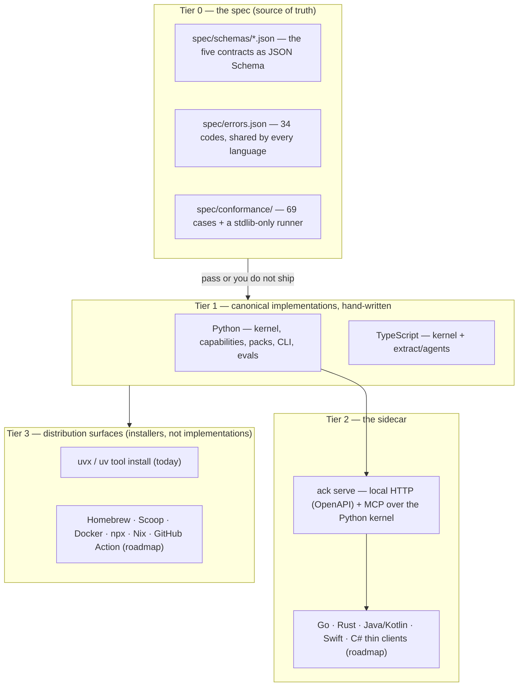
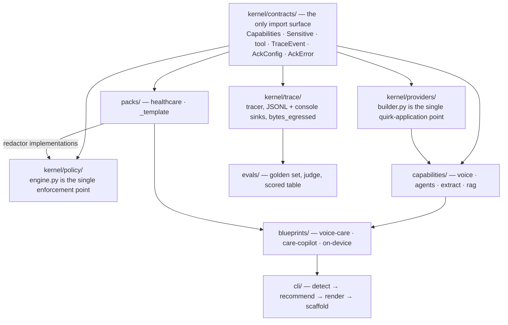
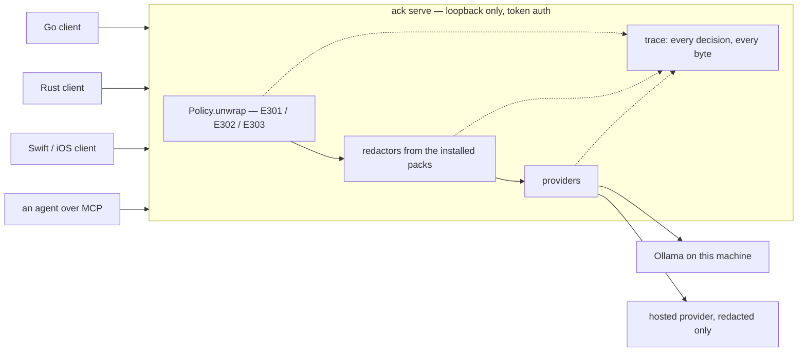

# Architecture

> agenticcarekit — the open-model stack for health AI. Runs on your laptop. Ships with the privacy boundary built in.

The design problem is not "how do I call a local model". It is: *how do you make
"available everywhere" mean one implementation instead of five that diverge inside a
month, and how do you make a privacy boundary that a distracted developer cannot
accidentally step around.*

Everything below follows from those two.

---

## The four tiers



**Tier 0 is not documentation.** `spec/conformance/runner.py` is stdlib-only and takes
an adapter command on argv; any implementation in any language proves itself by
answering JSON lines. Both current implementations report `69/69 passed · 0 failed ·
0 skipped`, and a skip is never counted as a pass. The corpus is shared, never
vendored — a port that copies the fixtures has forked the spec.

Expected values in the corpus were derived by hand from `docs/CONTRACTS.md`, not
generated from the implementation, then run against it. All 20 message-build payloads
matched on the first execution: two independent readings of the same rules agreeing
byte-for-byte is the only cross-validation that means anything here.

**Tier 1 is deliberately two languages, not five.** Python because the AI and
health-data ecosystems live there. TypeScript because voice UIs and clinical frontends
are web. A third hand-written port would be a maintenance liability, which is exactly
what Tier 2 exists to prevent.

---

## Inside the Python implementation



Three rules hold this together, and each is enforced by tests rather than etiquette:

1. **One quirk-application point.** `kernel/providers/builder.py::build_ollama_chat`
   is where sampling defaults, `<|think|>` injection, thought-block stripping,
   modality ordering, vision-token presets, and media encoding all happen — once. The
   OpenAI-compatible provider *imports* those decisions rather than re-deriving them.
   Twenty conformance cases assert the resulting payload byte-for-byte.
2. **One enforcement point.** See the next section.
3. **Packs do not know about blueprints, and blueprints do not know about the CLI.**
   The arrows only point one way. `_template/` exists so that "pack" is an interface
   rather than a folder that will be redesigned the first time someone tries a second
   domain.

---

## Why the sidecar is the enforcement chokepoint

The naive way to support Go, Rust, and Swift is to write a client library for each.
Then the privacy boundary exists five times, is subtly different five times, and one
of the five is wrong. Every new language multiplies the *correctness* surface.

`ack serve` inverts that. The policy engine, the redactors, and the trace live in one
local process. A thin client speaks HTTP or MCP to it and receives only what policy
already authorised.



A thin Go client **cannot** accidentally bypass PHI enforcement, because it never
touches the enforcement path. That turns every additional language from a correctness
risk into a convenience feature — which is the only way "available everywhere" scales.

The same reasoning applies inside one language. `Sensitive.unwrap_for` delegates to
`Policy.unwrap`, and `Policy.unwrap` is the only code in the toolkit that reveals a
wrapped value on the way to a provider. One path means one place to audit and one
place to change. See [privacy.md](privacy.md) and
[THREATMODEL.md](../packages/agenticcarekit/kernel/policy/THREATMODEL.md) for what
that does and does not buy you.

**Status:** shipped and smoke-verified. `ack serve` binds `127.0.0.1:4422`, writes a
`0600` token file at `<project>/.ack/serve.token`, serves twelve `/v1` routes plus an
OpenAPI document, and `ack serve --mcp` exposes seven MCP tools over stdio
(`init_project`, `add_capability`, `doctor`, `run_eval`, `get_manifest`,
`search_models`, `explain_error`). A non-loopback bind requires `--allow-remote`. It is
the newest surface in the project — see
[recipes/run-the-sidecar.md](recipes/run-the-sidecar.md).

---

## Capability negotiation

Providers **declare** what they can do; the runtime negotiates. It never infers and
never silently degrades.

```python
caps.missing(modalities_in={Modality.AUDIO}, tool_calling=True)
# -> ["audio input", "tool calling"]
```

Those gap strings are part of the contract — the conformance corpus pins both their
text and their ordering, and they feed `CapabilityMismatch` verbatim. That is what
turns "audio is E2B/E4B only" from a footnote nobody reads into a startup error with
the fix attached:

```
  ✗ E203  Model does not support a required input modality
          native audio input is available on gemma4:e2b and gemma4:e4b only.

          ack init --model gemma4:e4b-mlx
```

Raised **before any network call** — the acceptance test constructs the provider with
an HTTP client whose every method raises, then asserts the error. A fallback chain
that lacks a required modality raises rather than degrading: fallback is resilience,
never a capability escape hatch. Unknown model tags get deliberately conservative
capabilities, because declaring less costs a loud fixable error while declaring more
costs a silent wrong answer.

---

## The ejectability ladder

Invariant 3: **everything is ejectable.** Concretely, four rungs, each usable on its
own:

| Rung | You keep | You give up | How |
|---|---|---|---|
| 4 · Blueprint | the generated `app/`, `ack.toml`, `Makefile` | nothing yet — it is your code from `ack init` onward | `ack init` |
| 3 · Packs | FHIR-lite models, `healthcare.phi`, synthetic data | the generated app shape | `from agenticcarekit.packs.healthcare import PHIRedactor` |
| 2 · Capabilities | `VoiceLoop`, `AgentLoop`, `extract`, `LocalIndex` | domain models and redactors | `from agenticcarekit.capabilities.extract import extract` |
| 1 · Kernel | `build_ollama_chat`, `Policy`, `Tracer`, `provider_for` | the loops | `from agenticcarekit.kernel.providers import build_ollama_chat` |
| 0 · Raw client | your own `httpx` call | all of it | `OllamaProvider(...).client` — the raw `httpx.Client` |

Rung 0 is the one that matters. Every concrete provider exposes its raw client by
convention, so no abstraction here can trap you. That is the promise that makes
depending on this project reversible, which is precisely what makes people willing to
depend on it.

`ack eject prompts` is the mechanical version for prompts specifically: it copies
every packaged prompt `.md` into `./prompts/` in your project, after which behaviour
changes without touching logic. It never clobbers an existing file unless you pass
`--force`. Today `prompts` is the only registered ejectable; the registry
(`cli/project_ops.py::EJECTABLES`) is one dict and more entries are additive.

---

## Determinism

`ack init` twice with the same inputs produces a byte-identical tree — asserted by
walking both trees and comparing sha256 per file, symlinks included. No timestamps, no
absolute paths, no `uuid4()`, sorted file iteration. `AckConfig.to_toml()` is
byte-stable, `TraceEvent.to_json()` sorts keys, and `SyntheticGenerator(seed)` draws
every random value from exactly one `random.Random(seed)`.

This is an agent-legibility feature before it is a hygiene feature. Agents navigate by
convention and break on surprises; a generator that emits a different tree on Tuesday
is a generator agents cannot use.

---

## Detection and recommendation

`cli/detect/probes.py` runs 13 probes concurrently, each with its own timeout and
graceful degradation — a failed probe yields `unknown`, never blocks, never crashes
the run. `cli/recommend/rules.py` is a declarative table of 7 hard filters and 9 soft
scores rather than buried conditionals, because it has to be auditable, testable, and
able to explain itself.

Every filter and score contributes a short human string; the top two become the `←`
annotations on the plan screen. A recommendation corpus of 15 recorded machine
profiles asserts, for 27 (machine, blueprint) pairs, both the winner **and** one
verbatim reason string. A correct recommendation with a wrong explanation is a failed
test — the explanation is the product.

Provider API keys are probed for **presence only**. A test asserts that no key value
ever reaches serialized `MachineFacts`, and a second asserts `ack doctor` never prints
one.

---

## Related

- [CONTRACTS.md](CONTRACTS.md) — the five frozen contracts, and the rule for changing them
- [privacy.md](privacy.md) — the boundary, the threat model, the non-claims
- [comparison.md](comparison.md) — what this is worse at than the alternatives
- [../spec/README.md](../spec/README.md) — Tier 0 charter and versioning
- [../spec/conformance/README.md](../spec/conformance/README.md) — the adapter protocol
- [../packages/ts/README.md](../packages/ts/README.md) — the TypeScript port's own support matrix
